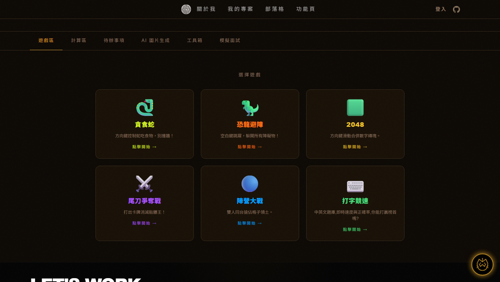
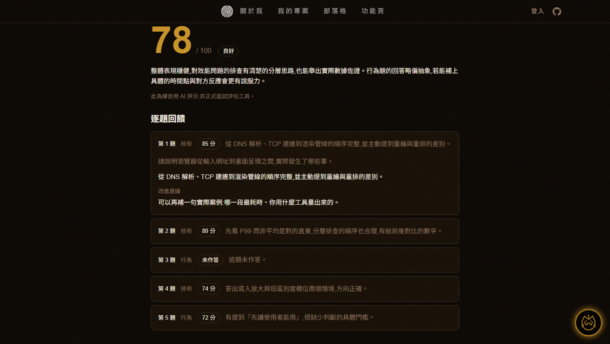
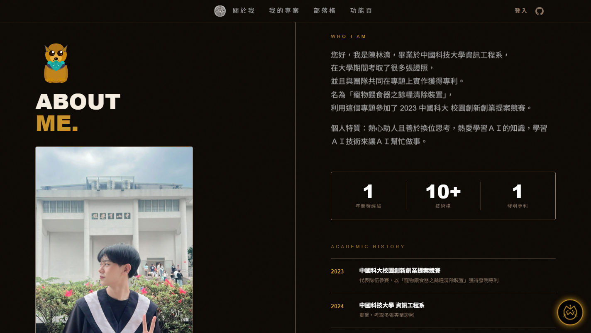

<div align="center">

# 🚀 Wayne's Portfolio & Editorial Studio

**一個全端個人作品集網站**
訪客可以在上面實際操作遊戲、工具與 AI 模擬面試,而不只是看一頁靜態履歷。

<br>

<a href="https://my-portfolio-waynely-chens-projects.vercel.app">
  
</a>

<br>

[](https://react.dev/)
[](https://nodejs.org/)
[](https://neon.tech/)
[](https://socket.io/)
[](https://ai.google.dev/)
[](https://vercel.com/)

<br>



<table>
  <tr>
    <td width="50%"></td>
    <td width="50%"></td>
  </tr>
  <tr>
    <td align="center"><sub><b>AI 模擬面試官</b> — 逐題評分與改進建議</sub></td>
    <td align="center"><sub><b>首頁</b> — GSAP 滾動動畫與個人介紹</sub></td>
  </tr>
</table>

</div>

---

## 📋 目錄

- [這個站在做什麼](#-這個站在做什麼)
- [核心特色](#-核心特色)
- [幾個比較有意思的實作](#-幾個比較有意思的實作)
- [技術棧](#-技術棧)
- [專案結構](#-專案結構)
- [本地開發](#-本地開發)
- [聯繫我](#-聯繫我)

---

## 🎯 這個站在做什麼

作品集網站最容易變成「一頁式靜態履歷」—— 訪客捲到底、關掉、忘記。

這個站的差異化全部集中在 **功能頁 (`/fun`)**:六個分頁,每一個都是可以真的動手玩的東西 —— 遊戲、計算工具、待辦清單、AI 繪圖、開發者工具箱,以及一場 AI 主持的模擬面試。目標很單純:**讓訪客願意留下來操作**,而不只是瀏覽。

其餘部分(首頁動畫、專案展示、部落格、會員系統)是一個作品集該有的基礎,做得完整但不是重點。

---

## 🌟 核心特色

### 🤖 Wobot AI 助理

站內右下角的常駐 AI 助理,由 Google Gemini 驅動。

- **三種人格模式**:正常(專業友善)、傲嬌(毒舌吐槽)、崇拜(極度誇讚)
- **語音雙向**:Edge TTS (`msedge-tts`) 語音輸出 + 瀏覽器原生語音辨識輸入
- **表情動畫系統**:依對話情境切換的即時表情(說話、大笑、眨眼、思考)
- **AI 繪圖**:整合 Stability AI 即時生成畫像

> 助理對本站的知識目前以系統提示注入(見 [`backend/src/routes/ai.js`](backend/src/routes/ai.js));`schema.sql` 內已備妥 pgvector 的資料表結構,尚未接入檢索流程。

### 🎯 AI 模擬面試官

選一個職缺方向與語言,由 AI 出五題、逐題語音朗讀、文字作答,最後給出總分與**逐題的具體改進建議**。

- **四個方向**:前端 / 後端 / 全端 / 新鮮人,題目由 Gemini 依方向生成(3–4 題技術 + 1–2 題行為)
- **中英雙語**:切換語言時題目、AI 回饋與**整個介面**都跟著換,語音也換聲線
- **語音朗讀**:每題自動朗讀,可重聽 / 停止 / 靜音,語速 0.75x / 1x / 1.25x
- **結果頁**:總分、評等、總評、逐題摺疊回饋,可一鍵複製純文字或列印成 PDF
- **評分失敗時保住作答**:五段作答全文留在畫面上,重試送出的請求與第一次逐位元組相同

### 🎮 互動遊戲區

- **尾刀爭奪戰**:卡牌制 Boss 戰,魔王是 WebGL 即時光線行進 (raymarching) 算出來的 3D 骷髏,受擊與攻擊都有對應的著色器動畫
- **陣營大戰**:Socket.io 即時同步的雙人搶格子對戰
- **打字競速**:中英文題庫,即時計算速度與正確率,附排行榜
- **經典重構**:貪食蛇、恐龍避障、2048

### 🧰 開發者工具箱

七個純前端、零上傳的小工具(JSON 格式化、Base64、JWT 解碼、時間戳轉換、雜湊、UUID、URL 編碼)。全部在瀏覽器本機完成,貼進去的內容不會離開你的電腦。

### ✍️ 技術部落格

- **前端快取層**:`sessionStorage` 智能快取,切換分頁不重複請求([`frontend/src/utils/fetchBlog.js`](frontend/src/utils/fetchBlog.js))
- **Markdown 渲染**:支援 GFM、程式碼語法高亮、圖片嵌入

### 🎨 視覺與動畫

- **滾動動畫**:GSAP ScrollTrigger + SplitType 的逐字進場與段落轉場
- **平滑滾動**:Lenis 滾動引擎
- **自定義動態游標**:磁吸效果與互動回饋
- **Preloader**:首次進站的載入動畫

### 🔐 會員與社群

- **多元登入**:Google / GitHub / Facebook / LINE OAuth 2.0 + 本地註冊
- **JWT 雙 Token**:Access Token(記憶體)+ Refresh Token(httpOnly cookie)
- **信箱驗證與密碼重設**:SMTP 寄信流程完整實現
- **留言、表情反應、個人待辦清單**

---

## 🔍 幾個比較有意思的實作

如果你只想看幾段程式碼,我會推薦這幾處 —— 它們都是踩過坑之後才長成現在的樣子:

| 主題 | 檔案 | 為什麼值得看 |
|:---|:---|:---|
| **不採信模型自報的題號** | [`ai.js`](backend/src/routes/ai.js) | Gemini 回傳的 `questionIndex` 實測是 1-based,照它對齊會讓兩題拿到同一則評語 —— 而整份回饋看起來格式完全正常 |
| **語速白名單用 `Map`** | [`ai.js`](backend/src/routes/ai.js) | `rate` 最終會被內插進 `<prosody rate="...">`;用物件查表時 `'constructor'` 這類鍵會查到 `Object.prototype` 上的東西 |
| **逾時每次嘗試各自計時** | [`ai.js`](backend/src/routes/ai.js) | 把逾時包在整個重試迴圈外面,上游一變慢就直接失敗,重試等於沒有作用 |
| **評分失敗時保住作答** | [`InterviewTab.jsx`](frontend/src/components/interview/InterviewTab.jsx) | 使用者打完五段字最後什麼都沒拿到,是這個功能唯一不可接受的失敗 |
| **WebGL 骷髏魔王** | [`BossSkull.jsx`](frontend/src/components/boss-skull/BossSkull.jsx) | 用 SDF 組合出頭骨並即時光線行進,沒有模型檔;依賴只有 ~10KB 的 OGL |
| **CSS 分層的坑** | [`index.css`](frontend/src/index.css) | 沒有分層的 `*` reset 永遠贏過 `@layer utilities`,曾讓全站的 Tailwind 間距工具類靜默失效 |

---

## 🛠 技術棧

### 🎨 前端

| 類別 | 技術 |
|:---|:---|
| **框架 / 路由** | React 18 · Vite 8 · React Router v7 |
| **狀態管理** | Zustand |
| **樣式 / UI** | Tailwind CSS 4 · Radix UI (Dialog, Tooltip, Progress) |
| **動畫 / 滾動** | GSAP (ScrollTrigger, SplitType) · Framer Motion · Lenis |
| **圖形 / 遊戲** | OGL (WebGL 3D 魔王) · Matter.js (物理引擎) |
| **即時通訊** | Socket.io Client |
| **Markdown** | react-markdown · remark-gfm · rehype-raw |

### ⚙️ 後端

| 類別 | 技術 |
|:---|:---|
| **框架 / 即時通訊** | Node.js · Express · Socket.io |
| **資料庫** | PostgreSQL (Neon) |
| **AI / 語音** | Google Gemini · Stability AI · Edge TTS (`msedge-tts`) |
| **認證 / 安全** | Passport.js (Google, GitHub, Facebook, LINE, Local) · JWT 雙 Token · bcrypt · Helmet |
| **寄信** | Nodemailer (SMTP) |
| **測試** | Vitest — 後端 399 個測試 · node:test — 前端 43 個測試 |

### ☁️ 部署

| 服務 | 用途 |
|:---|:---|
| **Vercel** | 前端靜態部署 + serverless proxy |
| **Render** | 後端 API + WebSocket |
| **Neon** | Serverless PostgreSQL |

---

## 📂 專案結構

<details>
<summary><b>展開完整目錄樹</b></summary>

<br>

```text
MyPortfolio/
├── frontend/                    # 🎨 前端（Vite + React）
│   ├── src/
│   │   ├── components/          # UI 元件
│   │   │   ├── AIAssistant.jsx  #   Wobot AI 助理
│   │   │   ├── Hero.jsx         #   首頁 Hero 滾動動畫
│   │   │   ├── About.jsx        #   關於我
│   │   │   ├── Projects.jsx     #   專案展示
│   │   │   ├── Blog.jsx         #   部落格列表
│   │   │   ├── Marquee.jsx      #   跑馬燈
│   │   │   ├── WorkTimeline.jsx #   工作經歷時間軸
│   │   │   ├── Certificates.jsx #   證照展示
│   │   │   ├── Comments.jsx     #   留言系統
│   │   │   ├── Reactions.jsx    #   表情反應
│   │   │   ├── YorkieDog.jsx    #   約克夏互動角色
│   │   │   ├── Preloader.jsx    #   載入動畫
│   │   │   ├── TopNav.jsx       #   導航列
│   │   │   ├── Footer.jsx       #   頁尾
│   │   │   ├── boss-skull/      #   WebGL 3D 骷髏魔王
│   │   │   ├── devtools/        #   開發者工具箱
│   │   │   ├── interview/       #   AI 模擬面試官
│   │   │   ├── typing-race/     #   打字競速
│   │   │   └── ui/              #   通用 UI 元件
│   │   ├── pages/               # 頁面路由
│   │   │   ├── BlogPage.jsx     #   部落格頁
│   │   │   ├── BlogPostPage.jsx #   文章詳情頁
│   │   │   ├── ProjectsPage.jsx #   專案頁
│   │   │   ├── FunPage.jsx      #   功能頁（六個互動分頁）
│   │   │   ├── Login.jsx        #   登入/註冊
│   │   │   └── ...              #   其他頁面
│   │   ├── hooks/               # 自定義 Hooks
│   │   ├── store/               # Zustand 狀態管理
│   │   ├── services/            # API 服務層
│   │   ├── utils/               # 工具函式
│   │   └── config/              # 設定檔
│   └── public/                  # 靜態資源
│
├── backend/                     # ⚙️ 後端（Node.js + Express）
│   ├── .env.example             # 環境變數範本
│   └── src/
│       ├── index.js             # 伺服器入口
│       ├── routes/              # API 路由
│       │   ├── ai.js            #   AI 對話 / TTS / 繪圖 / 模擬面試
│       │   ├── auth.js          #   認證 (OAuth + JWT)
│       │   ├── blog.js          #   部落格 CRUD
│       │   ├── projects.js      #   專案（GitHub API）
│       │   ├── boss.js          #   Boss 戰
│       │   ├── faction.js       #   陣營系統
│       │   ├── leaderboard.js   #   排行榜
│       │   ├── comments.js      #   留言
│       │   └── reactions.js     #   表情反應
│       ├── interview/           # 模擬面試的提示詞、schema 與評測
│       ├── controllers/         # 控制器層
│       ├── services/            # 服務層（GitHub 整合）
│       ├── sockets/             # WebSocket 即時通訊
│       ├── db/                  # 資料庫
│       │   ├── schema.sql       #   完整資料表結構
│       │   ├── seed_blog.js     #   部落格種子資料
│       │   ├── seed_knowledge.js#   知識庫種子
│       │   └── index.js         #   DB 連線池
│       ├── middlewares/         # 中間件
│       ├── config/              # Passport 設定
│       └── utils/               # JWT / Mailer 工具
│
├── docs/screenshots/            # README 用的截圖
├── .gitignore
└── README.md
```

</details>

---

## 🚀 本地開發

<details>
<summary><b>展開完整的安裝與部署步驟</b></summary>

<br>

### 前置需求

- **Node.js** >= 18
- **PostgreSQL** 資料庫（推薦使用 [Neon](https://neon.tech/) 免費方案）
- **API Keys**：Gemini API、Stability AI、GitHub Token

### 1. Clone 專案

```bash
git clone https://github.com/WayneLY-Chen/MyPortfolio.git
cd MyPortfolio
```

### 2. 安裝依賴

```bash
# 前端
cd frontend && npm install

# 後端
cd ../backend && npm install
```

### 3. 設定環境變數

```bash
cp backend/.env.example backend/.env
# 編輯 backend/.env 填入你的實際值
```

| 變數 | 說明 |
|------|------|
| `DATABASE_URL` | PostgreSQL 連線字串（Neon） |
| `GEMINI_API_KEY` | Google Gemini AI API Key |
| `STABILITY_API_KEY` | Stability AI 繪圖 API Key |
| `GITHUB_TOKEN` | GitHub Personal Access Token（讀取 Repo 資訊） |
| `JWT_ACCESS_SECRET` | JWT Access Token 密鑰 |
| `JWT_REFRESH_SECRET` | JWT Refresh Token 密鑰 |
| `GOOGLE_CLIENT_*` | Google OAuth 2.0 憑證 |
| `GITHUB_CLIENT_*` | GitHub OAuth 2.0 憑證 |
| `LINE_CHANNEL_*` | LINE Login 憑證 |
| `FACEBOOK_APP_*` | Facebook Login 憑證 |
| `SMTP_*` | SMTP 寄信設定（Gmail App Password） |

### 4. 初始化資料庫

```bash
cd backend

# 建立資料表
psql $DATABASE_URL -f src/db/schema.sql

# 匯入部落格種子資料
node src/db/seed_blog.js

# 匯入知識庫
node src/db/seed_knowledge.js
```

### 5. 啟動開發伺服器

```bash
# 後端 (port 3001)
cd backend && npm run dev

# 前端 (port 5173)，開另一個終端
cd frontend && npm run dev
```

開啟瀏覽器前往 `http://localhost:5173` 🎉

### 6. 執行測試

```bash
cd backend && npm test
```

### 部署

**前端 → Vercel**：Import GitHub Repo，Root Directory 設為 `frontend`，Build Command `npm run build`，Output Directory `dist`。

**後端 → Render**：Root Directory 設為 `backend`，Build Command `npm install`，Start Command `npm start`，並設定所有環境變數。

**資料庫 → Neon**：建立免費的 PostgreSQL,複製連線字串到 `DATABASE_URL`,執行 `schema.sql` 與 seed 腳本。

</details>

---

## 👨‍💻 聯繫我

<div align="center">

### 陳林淯 (Wayne)

*Creative Developer · Full-Stack Explorer*

<br>

[](https://github.com/WayneLY-Chen)
[](https://www.instagram.com/mr.w_1022/?hl=zh-tw)
[](mailto:qweasd226410@gmail.com)

<br>

💡 歡迎 ⭐ Star 此專案,或到站上右下角找 **Wobot 助理**問問關於我的事!

</div>
